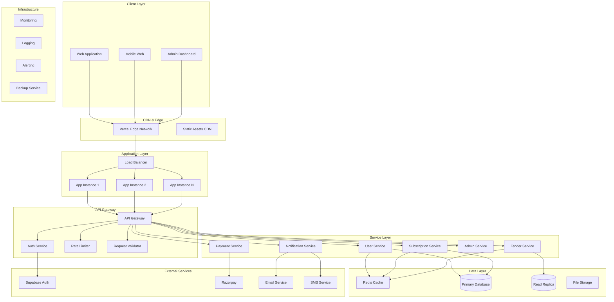

# Production Architecture Design
## RGUKT Tenders Portal - Enterprise Architecture

### Version: 1.0
### Date: January 5, 2025
### Status: DESIGN PHASE

---

## Architecture Overview

This document outlines the complete architectural transformation from the current monolithic structure to a production-ready, scalable, and maintainable enterprise architecture.

## 1. High-Level Architecture



## 2. Domain-Driven Design Structure

### New File Structure
```
src/
├── app/                          # Next.js App Router
│   ├── (auth)/                   # Auth route group
│   ├── (dashboard)/              # Dashboard route group
│   ├── (admin)/                  # Admin route group
│   ├── api/                      # API routes
│   └── globals.css
├── domains/                      # Domain-specific modules
│   ├── auth/
│   │   ├── components/
│   │   │   ├── LoginForm.tsx
│   │   │   ├── SignupForm.tsx
│   │   │   └── ProfileDropdown.tsx
│   │   ├── hooks/
│   │   │   ├── useAuth.ts
│   │   │   ├── useSession.ts
│   │   │   └── useProfile.ts
│   │   ├── services/
│   │   │   ├── auth.service.ts
│   │   │   ├── profile.service.ts
│   │   │   └── session.service.ts
│   │   ├── types/
│   │   │   ├── auth.types.ts
│   │   │   └── profile.types.ts
│   │   ├── utils/
│   │   │   ├── validators.ts
│   │   │   └── helpers.ts
│   │   └── __tests__/
│   │       ├── auth.service.test.ts
│   │       └── components/
│   ├── subscriptions/
│   │   ├── components/
│   │   │   ├── PricingTable.tsx
│   │   │   ├── SubscriptionCard.tsx
│   │   │   └── PaymentForm.tsx
│   │   ├── hooks/
│   │   │   ├── useSubscription.ts
│   │   │   ├── usePayment.ts
│   │   │   └── usePlans.ts
│   │   ├── services/
│   │   │   ├── subscription.service.ts
│   │   │   ├── payment.service.ts
│   │   │   └── plan.service.ts
│   │   ├── types/
│   │   │   ├── subscription.types.ts
│   │   │   └── payment.types.ts
│   │   └── __tests__/
│   ├── tenders/
│   │   ├── components/
│   │   │   ├── TenderList.tsx
│   │   │   ├── TenderCard.tsx
│   │   │   ├── TenderFilters.tsx
│   │   │   └── TenderDetails.tsx
│   │   ├── hooks/
│   │   │   ├── useTenders.ts
│   │   │   ├── useFilters.ts
│   │   │   └── useSearch.ts
│   │   ├── services/
│   │   │   ├── tender.service.ts
│   │   │   ├── search.service.ts
│   │   │   └── filter.service.ts
│   │   ├── types/
│   │   │   ├── tender.types.ts
│   │   │   └── filter.types.ts
│   │   └── __tests__/
│   ├── admin/
│   │   ├── components/
│   │   │   ├── UserManagement.tsx
│   │   │   ├── Analytics.tsx
│   │   │   └── SystemSettings.tsx
│   │   ├── hooks/
│   │   │   ├── useAdminAuth.ts
│   │   │   ├── useAnalytics.ts
│   │   │   └── useUserManagement.ts
│   │   ├── services/
│   │   │   ├── admin.service.ts
│   │   │   ├── analytics.service.ts
│   │   │   └── user-management.service.ts
│   │   ├── types/
│   │   │   ├── admin.types.ts
│   │   │   └── analytics.types.ts
│   │   └── __tests__/
│   └── notifications/
│       ├── components/
│       ├── hooks/
│       ├── services/
│       ├── types/
│       └── __tests__/
├── shared/                       # Shared across domains
│   ├── components/
│   │   ├── ui/                   # shadcn/ui components
│   │   ├── layout/
│   │   │   ├── Header.tsx
│   │   │   ├── Footer.tsx
│   │   │   └── Sidebar.tsx
│   │   ├── forms/
│   │   │   ├── FormField.tsx
│   │   │   ├── FormError.tsx
│   │   │   └── FormSuccess.tsx
│   │   └── common/
│   │       ├── LoadingSpinner.tsx
│   │       ├── ErrorBoundary.tsx
│   │       └── ConfirmDialog.tsx
│   ├── hooks/
│   │   ├── useApi.ts
│   │   ├── useLocalStorage.ts
│   │   ├── useDebounce.ts
│   │   └── usePagination.ts
│   ├── services/
│   │   ├── api.service.ts
│   │   ├── cache.service.ts
│   │   ├── storage.service.ts
│   │   └── http.service.ts
│   ├── utils/
│   │   ├── constants.ts
│   │   ├── helpers.ts
│   │   ├── formatters.ts
│   │   ├── validators.ts
│   │   └── date.utils.ts
│   ├── types/
│   │   ├── api.types.ts
│   │   ├── common.types.ts
│   │   └── database.types.ts
│   └── __tests__/
├── infrastructure/               # Infrastructure concerns
│   ├── database/
│   │   ├── client.ts
│   │   ├── migrations/
│   │   ├── seeds/
│   │   └── types.ts
│   ├── cache/
│   │   ├── redis.client.ts
│   │   ├── cache.service.ts
│   │   └── strategies/
│   ├── monitoring/
│   │   ├── logger.ts
│   │   ├── metrics.ts
│   │   ├── tracing.ts
│   │   └── alerts.ts
│   ├── security/
│   │   ├── auth.middleware.ts
│   │   ├── rate-limiter.ts
│   │   ├── input-sanitizer.ts
│   │   └── encryption.ts
│   ├── email/
│   │   ├── client.ts
│   │   ├── templates/
│   │   └── types.ts
│   └── config/
│       ├── app.config.ts
│       ├── database.config.ts
│       └── external-services.config.ts
├── lib/                          # External library configurations
│   ├── supabase.ts
│   ├── redis.ts
│   ├── sentry.ts
│   └── razorpay.ts
└── __tests__/                    # Global test utilities
    ├── setup.ts
    ├── mocks/
    ├── fixtures/
    └── utils/
```

## 3. Service Architecture

### 3.1 Core Services

#### Authentication Service
```typescript
// domains/auth/services/auth.service.ts
export class AuthService {
  private supabase: SupabaseClient;
  private cache: CacheService;
  private logger: Logger;

  async signIn(email: string, password: string): Promise<AuthResult> {
    try {
      // 1. Validate input
      const validation = await this.validateCredentials(email, password);
      if (!validation.isValid) {
        throw new AuthError('INVALID_CREDENTIALS', validation.errors);
      }

      // 2. Authenticate with Supabase
      const { data, error } = await this.supabase.auth.signInWithPassword({
        email,
        password,
      });

      if (error) {
        await this.auditFailedLogin(email, error);
        throw new AuthError('AUTHENTICATION_FAILED', error.message);
      }

      // 3. Create/update user profile
      const profile = await this.ensureUserProfile(data.user);

      // 4. Cache session
      await this.cache.set(`session:${data.session.access_token}`, {
        user: data.user,
        profile,
        expiresAt: data.session.expires_at,
      }, 3600);

      // 5. Audit successful login
      await this.auditSuccessfulLogin(data.user);

      return {
        success: true,
        user: data.user,
        profile,
        session: data.session,
      };
    } catch (error) {
      this.logger.error('Authentication failed', { email, error });
      throw error;
    }
  }

  async signOut(token: string): Promise<void> {
    try {
      await this.supabase.auth.signOut();
      await this.cache.delete(`session:${token}`);
      await this.auditSignOut(token);
    } catch (error) {
      this.logger.error('Sign out failed', { token, error });
      throw error;
    }
  }

  async refreshToken(refreshToken: string): Promise<AuthResult> {
    // Implementation for token refresh
  }

  private async ensureUserProfile(user: User): Promise<UserProfile> {
    // Check if profile exists, create if not
  }

  private async auditFailedLogin(email: string, error: any): Promise<void> {
    // Log failed login attempts for security monitoring
  }

  private async auditSuccessfulLogin(user: User): Promise<void> {
    // Log successful logins for audit trail
  }
}
```

#### Subscription Service
```typescript
// domains/subscriptions/services/subscription.service.ts
export class SubscriptionService {
  private database: DatabaseClient;
  private cache: CacheService;
  private paymentService: PaymentService;
  private logger: Logger;

  async getCurrentSubscription(userId: string): Promise<UserSubscription | null> {
    try {
      // 1. Check cache first
      const cacheKey = `subscription:${userId}`;
      const cached = await this.cache.get<UserSubscription>(cacheKey);
      if (cached) {
        return cached;
      }

      // 2. Query database
      const subscription = await this.database
        .from('user_subscriptions')
        .select(`
          *,
          subscription_plans (*)
        `)
        .eq('user_id', userId)
        .eq('status', 'active')
        .maybeSingle();

      if (subscription) {
        // 3. Cache result
        await this.cache.set(cacheKey, subscription, 3600);
      }

      return subscription;
    } catch (error) {
      this.logger.error('Failed to get subscription', { userId, error });
      throw new SubscriptionError('FETCH_FAILED', error.message);
    }
  }

  async createSubscription(
    userId: string,
    planId: string,
    subscriptionType: 'monthly' | 'yearly'
  ): Promise<CreateSubscriptionResult> {
    try {
      // 1. Validate user and plan
      const user = await this.validateUser(userId);
      const plan = await this.validatePlan(planId);

      // 2. Check for existing active subscription
      const existing = await this.getCurrentSubscription(userId);
      if (existing) {
        throw new SubscriptionError('ALREADY_SUBSCRIBED', 'User already has an active subscription');
      }

      // 3. Calculate pricing
      const amount = subscriptionType === 'monthly' ? plan.price_monthly : plan.price_yearly;

      // 4. Create payment order
      const paymentOrder = await this.paymentService.createOrder({
        amount,
        currency: 'INR',
        userId,
        planId,
        subscriptionType,
      });

      // 5. Create subscription record (pending)
      const subscription = await this.database
        .from('user_subscriptions')
        .insert({
          user_id: userId,
          plan_id: planId,
          subscription_type: subscriptionType,
          status: 'pending',
          amount_paid: amount,
          payment_order_id: paymentOrder.id,
        })
        .select()
        .single();

      return {
        subscription,
        paymentOrder,
      };
    } catch (error) {
      this.logger.error('Failed to create subscription', { userId, planId, error });
      throw error;
    }
  }

  async activateSubscription(paymentId: string): Promise<void> {
    // Implementation for activating subscription after payment
  }

  async cancelSubscription(userId: string): Promise<void> {
    // Implementation for subscription cancellation
  }
}
```

### 3.2 API Layer Architecture

#### Standardized API Responses
```typescript
// shared/types/api.types.ts
export interface ApiResponse<T = any> {
  success: boolean;
  data?: T;
  error?: ApiError;
  meta?: ApiMeta;
}

export interface ApiError {
  code: string;
  message: string;
  details?: Record<string, any>;
  timestamp: string;
  requestId: string;
  path: string;
}

export interface ApiMeta {
  pagination?: {
    page: number;
    limit: number;
    total: number;
    totalPages: number;
  };
  rateLimit?: {
    remaining: number;
    reset: number;
    limit: number;
  };
}
```

#### API Route Handler
```typescript
// shared/services/api.service.ts
export class ApiHandler {
  static async handleRequest<T>(
    request: Request,
    handler: (req: Request) => Promise<T>
  ): Promise<Response> {
    const requestId = crypto.randomUUID();
    const startTime = Date.now();

    try {
      // 1. Request validation
      await this.validateRequest(request);

      // 2. Rate limiting
      await this.checkRateLimit(request);

      // 3. Authentication (if required)
      const user = await this.authenticateRequest(request);

      // 4. Execute handler
      const data = await handler(request);

      // 5. Success response
      const response: ApiResponse<T> = {
        success: true,
        data,
        meta: {
          rateLimit: await this.getRateLimitInfo(request),
        },
      };

      // 6. Log successful request
      logger.info('API request successful', {
        requestId,
        duration: Date.now() - startTime,
        path: new URL(request.url).pathname,
        method: request.method,
        userId: user?.id,
      });

      return NextResponse.json(response);
    } catch (error) {
      // 7. Error handling
      const apiError: ApiError = {
        code: error.code || 'INTERNAL_ERROR',
        message: error.message || 'An unexpected error occurred',
        timestamp: new Date().toISOString(),
        requestId,
        path: new URL(request.url).pathname,
      };

      // 8. Log error
      logger.error('API request failed', {
        requestId,
        error: apiError,
        duration: Date.now() - startTime,
      });

      const response: ApiResponse = {
        success: false,
        error: apiError,
      };

      return NextResponse.json(response, { status: error.status || 500 });
    }
  }
}
```

## 4. Database Architecture

### 4.1 New Schema Design

```sql
-- Core Users Table (Unified)
CREATE TABLE users (
  id UUID PRIMARY KEY DEFAULT gen_random_uuid(),
  email TEXT UNIQUE NOT NULL,
  email_verified BOOLEAN DEFAULT FALSE,
  phone TEXT,
  phone_verified BOOLEAN DEFAULT FALSE,
  full_name TEXT,
  avatar_url TEXT,
  role TEXT DEFAULT 'user' CHECK (role IN ('user', 'admin', 'super_admin')),
  status TEXT DEFAULT 'active' CHECK (status IN ('active', 'suspended', 'deleted')),
  metadata JSONB DEFAULT '{}'::jsonb,
  created_at TIMESTAMPTZ DEFAULT NOW(),
  updated_at TIMESTAMPTZ DEFAULT NOW(),
  deleted_at TIMESTAMPTZ,
  last_seen_at TIMESTAMPTZ
);

-- User Profiles (Extended Information)
CREATE TABLE user_profiles (
  id UUID PRIMARY KEY DEFAULT gen_random_uuid(),
  user_id UUID NOT NULL REFERENCES users(id) ON DELETE CASCADE,
  college_name TEXT,
  department TEXT,
  position TEXT,
  preferences JSONB DEFAULT '{}'::jsonb,
  notification_settings JSONB DEFAULT '{
    "email_notifications": true,
    "sms_notifications": false,
    "push_notifications": true,
    "tender_alerts": true
  }'::jsonb,
  created_at TIMESTAMPTZ DEFAULT NOW(),
  updated_at TIMESTAMPTZ DEFAULT NOW()
);

-- Subscription Plans (Enhanced)
CREATE TABLE subscription_plans (
  id UUID PRIMARY KEY DEFAULT gen_random_uuid(),
  name TEXT NOT NULL,
  description TEXT,
  price_monthly INTEGER NOT NULL, -- in paise
  price_yearly INTEGER NOT NULL,
  features JSONB NOT NULL DEFAULT '[]'::jsonb,
  limits JSONB NOT NULL DEFAULT '{
    "tender_views_per_month": 100,
    "search_queries_per_day": 50,
    "email_alerts_per_month": 10
  }'::jsonb,
  colleges_access INTEGER DEFAULT 1,
  alert_type TEXT DEFAULT 'email' CHECK (alert_type IN ('email', 'sms', 'realtime')),
  has_filters BOOLEAN DEFAULT FALSE,
  has_keyword_filter BOOLEAN DEFAULT FALSE,
  has_advanced_filters BOOLEAN DEFAULT FALSE,
  has_api_access BOOLEAN DEFAULT FALSE,
  is_active BOOLEAN DEFAULT TRUE,
  sort_order INTEGER DEFAULT 0,
  created_at TIMESTAMPTZ DEFAULT NOW(),
  updated_at TIMESTAMPTZ DEFAULT NOW()
);

-- User Subscriptions (Cleaned Up)
CREATE TABLE user_subscriptions (
  id UUID PRIMARY KEY DEFAULT gen_random_uuid(),
  user_id UUID NOT NULL REFERENCES users(id) ON DELETE CASCADE,
  plan_id UUID NOT NULL REFERENCES subscription_plans(id),
  subscription_type TEXT NOT NULL CHECK (subscription_type IN ('monthly', 'yearly')),
  status TEXT NOT NULL DEFAULT 'pending' CHECK (status IN ('pending', 'active', 'cancelled', 'expired', 'failed')),
  starts_at TIMESTAMPTZ,
  ends_at TIMESTAMPTZ,
  cancelled_at TIMESTAMPTZ,
  amount_paid INTEGER NOT NULL, -- in paise
  payment_method TEXT DEFAULT 'razorpay',
  razorpay_order_id TEXT,
  razorpay_payment_id TEXT,
  razorpay_subscription_id TEXT,
  auto_renew BOOLEAN DEFAULT TRUE,
  trial_ends_at TIMESTAMPTZ,
  metadata JSONB DEFAULT '{}'::jsonb,
  created_at TIMESTAMPTZ DEFAULT NOW(),
  updated_at TIMESTAMPTZ DEFAULT NOW(),
  
  CONSTRAINT valid_subscription_dates CHECK (
    (starts_at IS NULL AND status = 'pending') OR
    (starts_at IS NOT NULL AND ends_at > starts_at)
  )
);

-- Payment Orders (Enhanced)
CREATE TABLE payment_orders (
  id UUID PRIMARY KEY DEFAULT gen_random_uuid(),
  user_id UUID NOT NULL REFERENCES users(id) ON DELETE CASCADE,
  subscription_id UUID REFERENCES user_subscriptions(id) ON DELETE SET NULL,
  razorpay_order_id TEXT UNIQUE NOT NULL,
  razorpay_payment_id TEXT UNIQUE,
  razorpay_signature TEXT,
  amount INTEGER NOT NULL, -- in paise
  currency TEXT DEFAULT 'INR',
  status TEXT NOT NULL DEFAULT 'created' CHECK (status IN ('created', 'attempted', 'paid', 'failed', 'cancelled')),
  payment_method TEXT,
  failure_reason TEXT,
  notes JSONB DEFAULT '{}'::jsonb,
  created_at TIMESTAMPTZ DEFAULT NOW(),
  updated_at TIMESTAMPTZ DEFAULT NOW(),
  paid_at TIMESTAMPTZ,
  failed_at TIMESTAMPTZ
);

-- Usage Tracking
CREATE TABLE usage_logs (
  id UUID PRIMARY KEY DEFAULT gen_random_uuid(),
  user_id UUID NOT NULL REFERENCES users(id) ON DELETE CASCADE,
  resource_type TEXT NOT NULL, -- 'tender_view', 'search_query', 'email_alert', 'api_call'
  resource_id TEXT,
  metadata JSONB DEFAULT '{}'::jsonb,
  ip_address INET,
  user_agent TEXT,
  created_at TIMESTAMPTZ DEFAULT NOW()
);

-- Audit Logs (Comprehensive)
CREATE TABLE audit_logs (
  id UUID PRIMARY KEY DEFAULT gen_random_uuid(),
  table_name TEXT NOT NULL,
  record_id UUID,
  operation TEXT NOT NULL CHECK (operation IN ('INSERT', 'UPDATE', 'DELETE')),
  old_data JSONB,
  new_data JSONB,
  user_id UUID REFERENCES users(id),
  admin_user_id UUID REFERENCES users(id),
  ip_address INET,
  user_agent TEXT,
  session_id TEXT,
  created_at TIMESTAMPTZ DEFAULT NOW()
);

-- Indexes for Performance
CREATE INDEX idx_users_email ON users(email);
CREATE INDEX idx_users_status ON users(status) WHERE status != 'deleted';
CREATE INDEX idx_user_subscriptions_user_id ON user_subscriptions(user_id);
CREATE INDEX idx_user_subscriptions_status ON user_subscriptions(status) WHERE status = 'active';
CREATE INDEX idx_payment_orders_user_id ON payment_orders(user_id);
CREATE INDEX idx_payment_orders_razorpay_order_id ON payment_orders(razorpay_order_id);
CREATE INDEX idx_usage_logs_user_id_created_at ON usage_logs(user_id, created_at);
CREATE INDEX idx_audit_logs_table_record ON audit_logs(table_name, record_id);
CREATE INDEX idx_audit_logs_created_at ON audit_logs(created_at);

-- Row Level Security Policies
ALTER TABLE users ENABLE ROW LEVEL SECURITY;
ALTER TABLE user_profiles ENABLE ROW LEVEL SECURITY;
ALTER TABLE user_subscriptions ENABLE ROW LEVEL SECURITY;
ALTER TABLE payment_orders ENABLE ROW LEVEL SECURITY;
ALTER TABLE usage_logs ENABLE ROW LEVEL SECURITY;

-- Policies for users table
CREATE POLICY "Users can view own record" ON users
  FOR SELECT USING (auth.uid() = id);

CREATE POLICY "Users can update own record" ON users
  FOR UPDATE USING (auth.uid() = id);

-- Policies for user_profiles table
CREATE POLICY "Users can view own profile" ON user_profiles
  FOR SELECT USING (auth.uid() = user_id);

CREATE POLICY "Users can update own profile" ON user_profiles
  FOR UPDATE USING (auth.uid() = user_id);

CREATE POLICY "Users can insert own profile" ON user_profiles
  FOR INSERT WITH CHECK (auth.uid() = user_id);

-- Admin policies
CREATE POLICY "Admins can view all users" ON users
  FOR SELECT USING (
    EXISTS (
      SELECT 1 FROM users 
      WHERE id = auth.uid() 
      AND role IN ('admin', 'super_admin')
    )
  );

-- Functions for automatic timestamps
CREATE OR REPLACE FUNCTION update_updated_at()
RETURNS TRIGGER AS $$
BEGIN
  NEW.updated_at = NOW();
  RETURN NEW;
END;
$$ LANGUAGE plpgsql;

-- Triggers for automatic timestamps
CREATE TRIGGER update_users_updated_at
  BEFORE UPDATE ON users
  FOR EACH ROW EXECUTE FUNCTION update_updated_at();

CREATE TRIGGER update_user_profiles_updated_at
  BEFORE UPDATE ON user_profiles
  FOR EACH ROW EXECUTE FUNCTION update_updated_at();

CREATE TRIGGER update_subscription_plans_updated_at
  BEFORE UPDATE ON subscription_plans
  FOR EACH ROW EXECUTE FUNCTION update_updated_at();

CREATE TRIGGER update_user_subscriptions_updated_at
  BEFORE UPDATE ON user_subscriptions
  FOR EACH ROW EXECUTE FUNCTION update_updated_at();

CREATE TRIGGER update_payment_orders_updated_at
  BEFORE UPDATE ON payment_orders
  FOR EACH ROW EXECUTE FUNCTION update_updated_at();
```

### 4.2 Migration Strategy

```typescript
// infrastructure/database/migrations/001_create_new_schema.ts
export class CreateNewSchema implements Migration {
  async up(client: DatabaseClient): Promise<void> {
    // 1. Create new tables
    await this.createUsersTable(client);
    await this.createUserProfilesTable(client);
    await this.createSubscriptionPlansTable(client);
    await this.createUserSubscriptionsTable(client);
    await this.createPaymentOrdersTable(client);
    await this.createUsageLogsTable(client);
    await this.createAuditLogsTable(client);

    // 2. Create indexes
    await this.createIndexes(client);

    // 3. Set up RLS policies
    await this.createRLSPolicies(client);

    // 4. Create functions and triggers
    await this.createFunctionsAndTriggers(client);
  }

  async down(client: DatabaseClient): Promise<void> {
    // Rollback implementation
  }
}
```

## 5. Security Architecture

### 5.1 Authentication & Authorization

```typescript
// infrastructure/security/auth.middleware.ts
export class AuthMiddleware {
  static async authenticateRequest(request: Request): Promise<User | null> {
    try {
      const token = this.extractToken(request);
      if (!token) {
        return null;
      }

      // 1. Verify JWT token
      const payload = await this.verifyJWT(token);

      // 2. Check if session exists in cache
      const session = await cache.get(`session:${token}`);
      if (!session) {
        throw new AuthError('SESSION_EXPIRED');
      }

      // 3. Check if user is active
      const user = await this.validateUser(payload.userId);
      if (!user || user.status !== 'active') {
        throw new AuthError('USER_INACTIVE');
      }

      // 4. Update last seen
      await this.updateLastSeen(user.id);

      return user;
    } catch (error) {
      logger.warn('Authentication failed', { error: error.message });
      return null;
    }
  }

  static requireAuth() {
    return async (request: Request) => {
      const user = await this.authenticateRequest(request);
      if (!user) {
        throw new AuthError('AUTHENTICATION_REQUIRED', 401);
      }
      return user;
    };
  }

  static requireRole(roles: string[]) {
    return async (request: Request) => {
      const user = await this.requireAuth()(request);
      if (!roles.includes(user.role)) {
        throw new AuthError('INSUFFICIENT_PERMISSIONS', 403);
      }
      return user;
    };
  }
}
```

### 5.2 Input Validation & Sanitization

```typescript
// infrastructure/security/input-sanitizer.ts
export class InputSanitizer {
  static sanitizeString(input: string): string {
    return input
      .trim()
      .replace(/<script\b[^<]*(?:(?!<\/script>)<[^<]*)*<\/script>/gi, '')
      .replace(/javascript:/gi, '')
      .replace(/on\w+\s*=/gi, '');
  }

  static validateAndSanitize<T>(
    input: unknown,
    schema: ZodSchema<T>
  ): T {
    try {
      // 1. Validate with Zod
      const validated = schema.parse(input);

      // 2. Sanitize string fields
      return this.sanitizeObject(validated);
    } catch (error) {
      throw new ValidationError('INVALID_INPUT', error.message);
    }
  }

  static detectMaliciousInput(input: string): boolean {
    const maliciousPatterns = [
      /(<script|<\/script>)/i,
      /(javascript:|vbscript:|data:)/i,
      /(union\s+select|drop\s+table|delete\s+from)/i,
      /(\.\.\/)|(\.\.\\)/,
    ];

    return maliciousPatterns.some(pattern => pattern.test(input));
  }
}
```

### 5.3 Rate Limiting

```typescript
// infrastructure/security/rate-limiter.ts
export class RateLimiter {
  private redis: Redis;

  constructor(redis: Redis) {
    this.redis = redis;
  }

  async checkLimit(
    key: string,
    limit: number,
    windowMs: number
  ): Promise<RateLimitResult> {
    const now = Date.now();
    const window = Math.floor(now / windowMs);
    const redisKey = `rate_limit:${key}:${window}`;

    try {
      const current = await this.redis.incr(redisKey);
      
      if (current === 1) {
        await this.redis.expire(redisKey, Math.ceil(windowMs / 1000));
      }

      const remaining = Math.max(0, limit - current);
      const resetTime = (window + 1) * windowMs;

      return {
        allowed: current <= limit,
        remaining,
        resetTime,
        limit,
      };
    } catch (error) {
      // If Redis is down, allow the request but log the error
      logger.error('Rate limiting failed', { key, error });
      return {
        allowed: true,
        remaining: limit,
        resetTime: now + windowMs,
        limit,
      };
    }
  }

  async rateLimitMiddleware(
    request: Request,
    limits: RateLimitConfig[]
  ): Promise<void> {
    for (const config of limits) {
      const key = this.generateKey(request, config);
      const result = await this.checkLimit(key, config.limit, config.windowMs);

      if (!result.allowed) {
        throw new RateLimitError('RATE_LIMIT_EXCEEDED', 429, {
          limit: result.limit,
          remaining: result.remaining,
          resetTime: result.resetTime,
        });
      }
    }
  }
}
```

## 6. Monitoring & Observability

### 6.1 Logging Strategy

```typescript
// infrastructure/monitoring/logger.ts
export class Logger {
  private static instance: Logger;
  private winston: winston.Logger;

  constructor() {
    this.winston = winston.createLogger({
      level: process.env.LOG_LEVEL || 'info',
      format: winston.format.combine(
        winston.format.timestamp(),
        winston.format.errors({ stack: true }),
        winston.format.json()
      ),
      transports: [
        new winston.transports.Console(),
        new winston.transports.File({ filename: 'logs/error.log', level: 'error' }),
        new winston.transports.File({ filename: 'logs/combined.log' }),
      ],
    });
  }

  static getInstance(): Logger {
    if (!Logger.instance) {
      Logger.instance = new Logger();
    }
    return Logger.instance;
  }

  info(message: string, context: LogContext = {}): void {
    this.winston.info(message, {
      ...context,
      timestamp: new Date().toISOString(),
      environment: process.env.NODE_ENV,
    });
  }

  error(message: string, context: LogContext & { error?: Error } = {}): void {
    this.winston.error(message, {
      ...context,
      stack: context.error?.stack,
      timestamp: new Date().toISOString(),
      environment: process.env.NODE_ENV,
    });
  }

  audit(action: string, user: User, context: LogContext = {}): void {
    this.winston.info('AUDIT', {
      action,
      userId: user.id,
      userEmail: user.email,
      ...context,
      timestamp: new Date().toISOString(),
      type: 'audit',
    });
  }
}
```

### 6.2 Metrics & Alerting

```typescript
// infrastructure/monitoring/metrics.ts
export class MetricsService {
  private static metrics = new Map<string, number>();

  static trackResponseTime(endpoint: string, duration: number): void {
    const key = `response_time:${endpoint}`;
    this.updateMetric(key, duration);
    
    // Send to external monitoring service
    this.sendToMonitoring('response_time', {
      endpoint,
      duration,
      timestamp: Date.now(),
    });
  }

  static trackThroughput(endpoint: string): void {
    const key = `throughput:${endpoint}`;
    this.incrementMetric(key);
    
    this.sendToMonitoring('throughput', {
      endpoint,
      timestamp: Date.now(),
    });
  }

  static trackError(endpoint: string, error: Error): void {
    const key = `errors:${endpoint}`;
    this.incrementMetric(key);
    
    this.sendToMonitoring('error', {
      endpoint,
      error: error.message,
      stack: error.stack,
      timestamp: Date.now(),
    });

    // Check if we need to trigger alerts
    this.checkErrorThreshold(endpoint);
  }

  private static checkErrorThreshold(endpoint: string): void {
    const errorCount = this.metrics.get(`errors:${endpoint}`) || 0;
    const totalRequests = this.metrics.get(`throughput:${endpoint}`) || 0;
    
    if (totalRequests > 100 && errorCount / totalRequests > 0.01) {
      // Error rate > 1%, trigger alert
      this.triggerAlert('HIGH_ERROR_RATE', {
        endpoint,
        errorRate: errorCount / totalRequests,
        errorCount,
        totalRequests,
      });
    }
  }
}
```

## 7. Performance Optimization

### 7.1 Caching Strategy

```typescript
// infrastructure/cache/cache.service.ts
export class CacheService {
  private redis: Redis;
  
  constructor(redis: Redis) {
    this.redis = redis;
  }

  async get<T>(key: string): Promise<T | null> {
    try {
      const value = await this.redis.get(key);
      return value ? JSON.parse(value) : null;
    } catch (error) {
      logger.error('Cache get failed', { key, error });
      return null;
    }
  }

  async set(key: string, value: any, ttl: number = 3600): Promise<void> {
    try {
      await this.redis.setex(key, ttl, JSON.stringify(value));
    } catch (error) {
      logger.error('Cache set failed', { key, ttl, error });
    }
  }

  async invalidatePattern(pattern: string): Promise<void> {
    try {
      const keys = await this.redis.keys(pattern);
      if (keys.length > 0) {
        await this.redis.del(...keys);
      }
    } catch (error) {
      logger.error('Cache invalidation failed', { pattern, error });
    }
  }

  // Cache strategies
  async getOrSet<T>(
    key: string,
    factory: () => Promise<T>,
    ttl: number = 3600
  ): Promise<T> {
    const cached = await this.get<T>(key);
    if (cached !== null) {
      return cached;
    }

    const value = await factory();
    await this.set(key, value, ttl);
    return value;
  }
}
```

### 7.2 Database Optimization

```typescript
// infrastructure/database/query-optimizer.ts
export class QueryOptimizer {
  static optimizeUserSubscriptionQuery(userId: string) {
    return {
      from: 'user_subscriptions',
      select: `
        id,
        subscription_type,
        status,
        starts_at,
        ends_at,
        amount_paid,
        subscription_plans!inner (
          id,
          name,
          description,
          price_monthly,
          price_yearly,
          features,
          limits
        )
      `,
      where: {
        user_id: userId,
        status: 'active',
      },
      orderBy: { created_at: 'desc' },
      limit: 1,
    };
  }

  static optimizeTenderSearchQuery(filters: TenderFilters) {
    const query = {
      from: 'tenders',
      select: `
        id,
        title,
        description,
        college_name,
        department,
        tender_value,
        submission_deadline,
        created_at
      `,
      where: {},
      orderBy: { created_at: 'desc' },
      limit: filters.limit || 20,
      offset: (filters.page - 1) * (filters.limit || 20),
    };

    // Add filters dynamically
    if (filters.college) {
      query.where['college_name'] = filters.college;
    }
    
    if (filters.minValue) {
      query.where['tender_value'] = { gte: filters.minValue };
    }

    if (filters.keywords) {
      query.where['title'] = { ilike: `%${filters.keywords}%` };
    }

    return query;
  }
}
```

## 8. Testing Strategy

### 8.1 Test Architecture

```typescript
// __tests__/setup.ts
import { beforeAll, afterAll, afterEach } from '@jest/globals';
import { createClient } from '@supabase/supabase-js';
import { Redis } from 'ioredis';

// Test database and cache setup
let testDb: SupabaseClient;
let testCache: Redis;

beforeAll(async () => {
  // Setup test database
  testDb = createClient(
    process.env.TEST_SUPABASE_URL!,
    process.env.TEST_SUPABASE_ANON_KEY!
  );

  // Setup test cache
  testCache = new Redis({
    host: process.env.TEST_REDIS_HOST,
    port: parseInt(process.env.TEST_REDIS_PORT || '6379'),
    db: 1, // Use different database for tests
  });

  // Run migrations
  await runTestMigrations();
});

afterEach(async () => {
  // Clean up test data
  await cleanupTestData();
  await testCache.flushdb();
});

afterAll(async () => {
  await testDb.auth.signOut();
  await testCache.quit();
});
```

### 8.2 Test Examples

```typescript
// domains/auth/__tests__/auth.service.test.ts
describe('AuthService', () => {
  let authService: AuthService;
  let mockUser: User;

  beforeEach(() => {
    authService = new AuthService(testDb, testCache, logger);
    mockUser = createMockUser();
  });

  describe('signIn', () => {
    it('should successfully sign in with valid credentials', async () => {
      // Arrange
      const email = 'test@example.com';
      const password = 'validPassword123';
      
      jest.spyOn(testDb.auth, 'signInWithPassword')
        .mockResolvedValue({
          data: { user: mockUser, session: mockSession },
          error: null,
        });

      // Act
      const result = await authService.signIn(email, password);

      // Assert
      expect(result.success).toBe(true);
      expect(result.user).toEqual(mockUser);
      expect(testCache.set).toHaveBeenCalled();
    });

    it('should fail with invalid credentials', async () => {
      // Arrange
      const email = 'test@example.com';
      const password = 'invalidPassword';
      
      jest.spyOn(testDb.auth, 'signInWithPassword')
        .mockResolvedValue({
          data: { user: null, session: null },
          error: { message: 'Invalid credentials' },
        });

      // Act & Assert
      await expect(authService.signIn(email, password))
        .rejects.toThrow('AUTHENTICATION_FAILED');
    });
  });
});
```

### 8.3 Integration Tests

```typescript
// __tests__/integration/api/auth.test.ts
describe('Auth API Integration', () => {
  describe('POST /api/auth/signin', () => {
    it('should return 200 with valid credentials', async () => {
      // Arrange
      const user = await createTestUser();
      const credentials = {
        email: user.email,
        password: 'testPassword123',
      };

      // Act
      const response = await request(app)
        .post('/api/auth/signin')
        .send(credentials);

      // Assert
      expect(response.status).toBe(200);
      expect(response.body.success).toBe(true);
      expect(response.body.data.user.email).toBe(user.email);
    });

    it('should return 401 with invalid credentials', async () => {
      // Act
      const response = await request(app)
        .post('/api/auth/signin')
        .send({
          email: 'nonexistent@example.com',
          password: 'wrongPassword',
        });

      // Assert
      expect(response.status).toBe(401);
      expect(response.body.success).toBe(false);
      expect(response.body.error.code).toBe('AUTHENTICATION_FAILED');
    });
  });
});
```

### 8.4 End-to-End Tests

```typescript
// __tests__/e2e/subscription-flow.test.ts
import { test, expect } from '@playwright/test';

test.describe('Subscription Flow', () => {
  test('should complete subscription purchase', async ({ page }) => {
    // 1. Sign in
    await page.goto('/login');
    await page.fill('input[type="email"]', 'test@example.com');
    await page.fill('input[type="password"]', 'testPassword123');
    await page.click('button[type="submit"]');

    // 2. Navigate to pricing
    await page.goto('/pricing');
    await expect(page.locator('h1')).toContainText('Choose Your Plan');

    // 3. Select a plan
    await page.click('[data-testid="plan-all-access"] button');

    // 4. Complete payment (mock)
    await page.waitForSelector('[data-testid="payment-form"]');
    await page.click('[data-testid="yearly-option"]');
    await page.click('[data-testid="proceed-payment"]');

    // 5. Verify success
    await expect(page.locator('[data-testid="payment-success"]'))
      .toBeVisible();
    
    // 6. Verify subscription is active
    await page.goto('/dashboard');
    await expect(page.locator('[data-testid="subscription-status"]'))
      .toContainText('Active');
  });
});
```

## 9. Implementation Roadmap

### Phase 1: Foundation (Weeks 1-2)
1. **Security Critical**
   - Remove hardcoded secrets
   - Implement input sanitization
   - Add security headers middleware
   - Set up monitoring and alerting

2. **Core Infrastructure**
   - Set up new project structure
   - Implement centralized error handling
   - Create logging service
   - Set up test framework

### Phase 2: Core Services (Weeks 3-5)
1. **Authentication Service**
   - Refactor auth service with proper error handling
   - Implement token refresh mechanism
   - Add audit logging
   - Create comprehensive tests

2. **Database Migration**
   - Create new schema with proper relationships
   - Implement migration scripts
   - Set up connection pooling
   - Add performance indexes

3. **API Standardization**
   - Implement standardized response format
   - Add request validation middleware
   - Create rate limiting service
   - Add API documentation

### Phase 3: Business Logic (Weeks 6-8)
1. **Subscription Service**
   - Refactor subscription management
   - Implement caching layer
   - Add usage tracking
   - Create payment integration tests

2. **Performance Optimization**
   - Implement Redis caching
   - Optimize database queries
   - Add CDN configuration
   - Bundle size optimization

### Phase 4: Advanced Features (Weeks 9-12)
1. **Monitoring & Observability**
   - Complete monitoring dashboard
   - Add business metrics tracking
   - Implement alerting system
   - Performance profiling

2. **Security Hardening**
   - Add multi-factor authentication
   - Implement advanced rate limiting
   - Security penetration testing
   - Compliance audit

## 10. Success Metrics

### Technical Metrics
- **Response Time**: <200ms P95 for critical APIs
- **Uptime**: 99.9% availability
- **Error Rate**: <0.1% for all endpoints
- **Test Coverage**: >85% overall
- **Performance Score**: >95 on Lighthouse

### Business Metrics
- **User Experience**: <3s page load time
- **Conversion Rate**: >10% free to paid
- **Customer Satisfaction**: >4.5/5 rating
- **Support Tickets**: <2% of active users/month

This architecture design provides a comprehensive roadmap for transforming the current application into a production-ready, scalable, and maintainable enterprise SaaS platform.